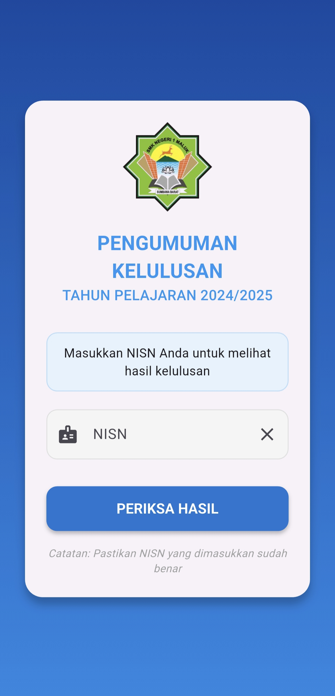
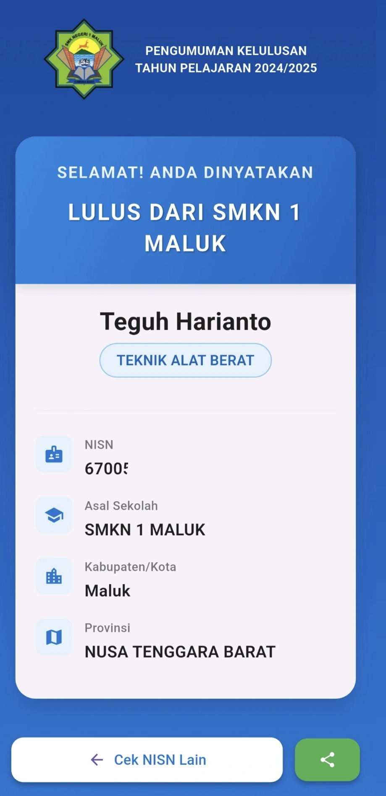

# Pengumuman Kelulusan SMKN 1 Maluk

<div align="center">


*A modern mobile application for graduation announcements at SMKN 1 Maluk.*

  <p float="left">
    
    
  </p>

</div>

## 📱 Project Overview

This Flutter application was created to improve the student experience during graduation announcements at SMKN 1 Maluk. After receiving feedback from students about difficulties with the school's existing web interface, I developed this mobile solution with an enhanced UI/UX design to make the graduation announcement process more engaging and user-friendly.

### 🌟 Key Features

- **Simple NISN Input**: Easy and intuitive interface for entering student ID numbers
- **Suspenseful Loading Animation**: Creates an exciting moment while checking results
- **Beautiful Results Display**: Clean presentation of graduation status and student information
- **Responsive Design**: Works across various Android devices
- **Error Handling**: Clear feedback when incorrect NISN is entered

## 🚀 Motivation

This project was born from hearing the frustrations of SMKN 1 Maluk students who were dissatisfied with the school's web-based announcement system. Many students complained about:

- Poor mobile responsiveness of the existing website
- Confusing user interface
- Slow loading times
- Lack of visual appeal during such an important moment

As someone passionate about using technology to solve real-world problems, I took the initiative to develop a solution that transforms the graduation announcement experience into something more modern and enjoyable.

## 💻 Technology Stack

- **Flutter**: For cross-platform mobile development
- **Dart**: Programming language
- **Custom Animations**: Implemented to enhance user engagement
- **Material Design**: Following modern UI/UX practices

## 📋 Implementation Details

### Architecture

The application follows a simple yet effective architecture:

1. **Input Screen**: For NISN entry
2. **Loading Screen**: With animated progress indicators
3. **Result Screen**: Displaying graduation status and student details

### Design Choices

- **Color Scheme**: School colors (blue) to maintain brand identity
- **Typography**: Clear, readable fonts for important information
- **Animation**: Thoughtfully designed to build excitement without being distracting
- **Error States**: Friendly error messages to guide users

## 🔧 Installation and Usage

### Prerequisites

- Flutter SDK
- Android Studio or VS Code with Flutter extensions

### Running the Project

1. Clone this repository
```bash
git clone https://github.com/yourusername/pengumuman-smkn1-maluk.git
```

2. Install dependencies
```bash
flutter pub get
```

3. Run the app
```bash
flutter run
```

### Building for Release

```bash
flutter build apk --release
```

## 📚 Lessons Learned

Developing this application taught me:

- Creating engaging UI/UX with Flutter animations
- Managing state for smooth transitions between screens
- Implementing proper error handling for better user experience
- Building applications with real users' needs in mind

## 📬 Contact Information

For questions, suggestions, or collaboration opportunities, please contact:

- GitHub: https://github.com/ForcesR2N
- Email: muhammadzuhrizal07@gmail.com
- LinkedIn: https://www.linkedin.com/in/muhammad-zuhrizal

---
